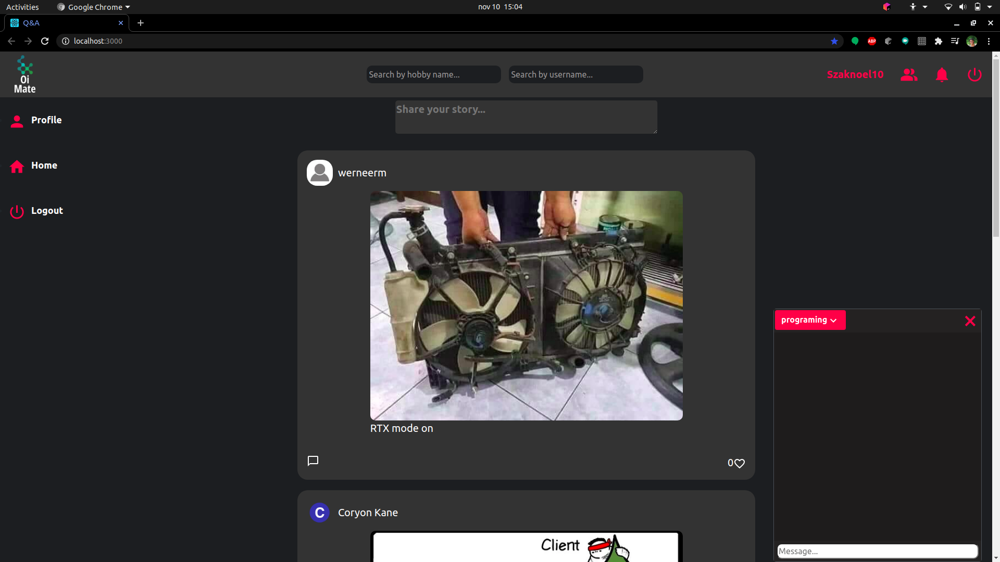

# Oi Mate Spring Boot

Frontend git repo link: https://github.com/LJoel777/Q-A_react

## Description

This is a simple social media app.

### Implemented:

- Post system
- Comment system
- Like system
- Users
- Login, Registration
- Search system
- Notifications
- Chat by topics

### Missing: 

- Rewrite project to microservices (Already work on it)
- Improving security

## Technologies: 

- PostgresSQL
- Spring Boot
- Spring Boot Security
- JWT token

## The final solution is on the develop brach.
